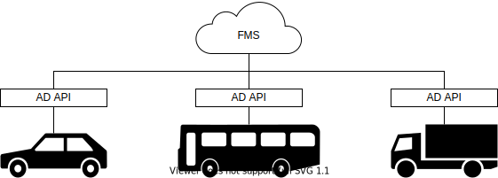

# Autoware Interface Design

## Abstract

Autoware defines two categories of interfaces. The first one is Autoware AD API for operating the vehicle from outside the autonomous driving system such as the Fleet Management System (FMS) and Human Machine Interface (HMI) for operators or passengers. The second one is Autoware Component Interface for internal components to communicate with each other.

## Concept

- Applications can operate multiple and various vehicles in a common way.

  

- Applications are not affected by version updates and implementation changes.

  

- Developers only need to know the interface to add new features and hardware.

  

## Requirements

Goals:

- AD API provides stable and long-term specifications. This enables unified access to all vehicles.
- AD API hides differences in version and implementation and absorbs the impact of changes.
- AD API has a default implementation and can be applied to some simple ODDs with options.
- The AD API implementation is extensible with the third-party components as long as it meets the specifications.
- Component Interface provides stable and medium-term specifications. This makes it easier to add components.
- Component Interface clarifies the public and private parts of a component and improves maintainability.
- Component Interface is extensible with the third-party design to improve the sub-components' reusability.

Non-goals:

- AD API does not cover security. Use it with other reliable methods.
- Component Interface is just a specification, it does not include an implementation.

## Architecture

The components of Autoware are connected via Component Interface.
Each component uses the interface to provide functionality and to access other components.
AD API implementation is also a component.
Since the functional elements required for AD API are defined as Component Interface, other components do not need to consider AD API directly.
Tools for evaluation and debugging, such as simulators, access both AD API and Component Interface.

Component Interface has a hierarchical specification.
The top-level architecture consists of some components. Each component has some options of the next-level architecture.
Developers select one of them when implementing the component. The simplest next-level architecture is monolithic.
This is an all-in-one and black box implementation, and is suitable for small group development, prototyping, and very complex functions.
Others are arbitrary architecture consists of sub-components and have advantages for large group development.
A sub-component can be combined with others that adopt the same architecture.
Third parties can define and publish their own architecture and interface for open source development.
It is desirable to propose them for standardization if they are sufficiently evaluated.

## Features

All interfaces of Autoware have the following features in common:

- Communication method
- Naming convention
- Logging
- Restrictions

AD API provides the following features:

- Version
- Operation Mode
- States
- Route
- Diagnostics
- Remote monitoring
- Remote control
- Vehicle Devices

Component Interface provides the following features:

- Requirement for AD API
- T.B.D.

## Interface and Data Structure

AD API covers the following use cases:

- Launch Autoware
- Bus Service

Refer to the following pages for AD API:

- T.B.D.

Refer to the following pages for Component Interface:

- T.B.D.

## Concern, Assumption, and Limitation

T.B.D.
