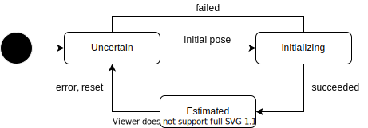

# Autoware States

## Power State

システムの起動と終了に関する状態を管理する。

| State     | Description  |
| --------- | ------------ |
| Start Up  | 起動処理中   |
| Power On  | 起動処理完了 |
| Shut Down | 終了処理中   |
| Power Off | 終了処理完了 |

## Driving State

車両の走行に関わる状態を管理する。他の状態遷移を参照している。

| State     | Description                                                                  |
| --------- | ---------------------------------------------------------------------------- |
| Preparing | ルートの待ち、ドアの開閉中、自己位置初期化中などの発車条件を満たさない状態。 |
| Ready     | 発車条件を満たしており、ユーザーからの承認操作を待っている状態。             |
| Driving   | 目的地に向かって走行している状態。                                           |

## Fail Safe State

車両の異常に関わる状態を管理する。

| State            | Description                              |
| ---------------- | ---------------------------------------- |
| Normal           | 正常状態                                 |
| Takeover Request | 正常だが異常の可能性が高くなっている状態 |
| MRM Operating    | 異常があり MRM を動作させている状態      |
| MRM Succeeded    | 異常があり MRM が成功した状態            |
| MRM Failed       | 異常があり MRM が失敗した状態            |

## Operation Mode

車両の制御モード。

| State      | Description |
| ---------- | ----------- |
| Direct     | 直接操作    |
| Stop       | 停止保持    |
| Autonomous | 自律制御    |
| Local      | 近接操作    |
| Remote     | 遠隔操作    |

## Moving State

車両の速度に関する状態遷移。

| State        | Description        |
| ------------ | ------------------ |
| Stopped      | 停止中             |
| Starting     | 発車確認中         |
| Moving       | 移動中             |
| Decelerating | 停止に向けて減速中 |

## Route State

ルートに関する状態遷移。目的地へのルートが設定されているかを管理する。

| State    | Description                                        |
| -------- | -------------------------------------------------- |
| Unset    | ルートが設定されていない状態。                     |
| Set      | ルートを設定されている状態。                       |
| Changing | ルートを走りながら別のルートを切り替えている状態。 |

## Goal State

目的地に関する状態遷移。ルートが設定されている場合に有効になる。 
※Route State (Set, Changing) のサブ状態にすることも検討する。

| State        | Description                    |
| ------------ | ------------------------------ |
| On The Way   | ルートを走行している状態。     |
| Arrive Soon  | ルートの終点に近づいた状態。   |
| Arrived Goal | ルートの終点まで到着した状態。 |

## Localization State

位置推定に関する状態遷移。車両の位置を推定されているかを管理する。

| State        | Description                                                        |
| ------------ | ------------------------------------------------------------------ |
| Uncertain    | 自己位置が未推定、もしくは、何らかの原因で信頼できなくなった状態。 |
| Initializing | 自己位置を推定している状態。                                       |
| Estimated    | 自己位置が推定できている状態。                                     |

## Vehicle Info

| Name          | Type  | Description      |
| ------------- | ----- | ---------------- |
| position      | Twist | 位置、角度       |
| velocity      | Twist | 速度、角速度     |
| acceleration  | Twist | 加速度、角加速度 |
| blinker       | Enum  | ウィンカー       |
| hazard        | Enum  | ハザード         |
| gear          | Enum  | ギア             |
| fuel.value    | float | 燃料（残量）     |
| fuel.capacity | float | 燃料（最大）     |
