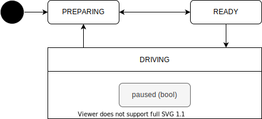

# Driving State

車両の走行に関わる状態を管理する。他の状態遷移を参照している。

| State     | Description                                                                |
| --------- | -------------------------------------------------------------------------- |
| PREPARING | ルートの待ち、ドアの開閉中、自己位置初期化中など発車条件を満たさない状態。 |
| READY     | 発車条件を満たしており、ユーザーからの承認操作を待っている状態。           |
| DRIVING   | 目的地に向かって走行している状態。                                         |
