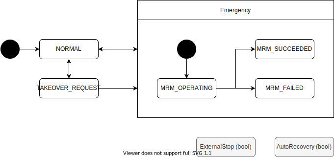

# Fail Safe State

車両の異常に関わる状態を管理する。

| State            | Description                                  |
| ---------------- | -------------------------------------------- |
| NORMAL           | 正常状態                                     |
| TAKEOVER_REQUEST | 異常の可能性が高く引き継ぎを要求している状態 |
| MRM_OPERATING    | 異常があり MRM を動作させている状態          |
| MRM_SUCCEEDED    | 異常があり MRM が成功した状態                |
| MRM_FAILED       | 異常があり MRM が失敗した状態                |
