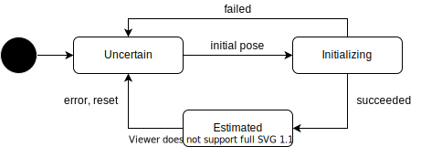

# Localization State

位置推定に関する状態遷移。車両の位置を推定されているかを管理する。

| State        | Description                                                        |
| ------------ | ------------------------------------------------------------------ |
| Uncertain    | 自己位置が未推定、もしくは、何らかの原因で信頼できなくなった状態。 |
| Initializing | 自己位置を推定している状態。                                       |
| Estimated    | 自己位置が推定できている状態。                                     |
