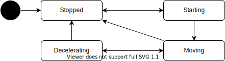

# Moving State

車両の速度に関する状態遷移。

| State        | Description        |
| ------------ | ------------------ |
| Stopped      | 停止中             |
| Starting     | 発車確認中         |
| Moving       | 移動中             |
| Decelerating | 停止に向けて減速中 |
