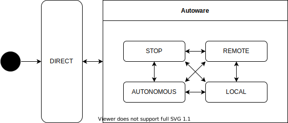

# Operation Mode

車両の制御モード。

| State      | Description                                                               |
| ---------- | ------------------------------------------------------------------------- |
| DIRECT     | The vehicle is controlled directly. The behavior depends on the hardware. |
| STOP       | The vehicle is controlled to hold a stop.                                 |
| AUTONOMOUS | The vehicle is autonomously controlled.                                   |
| LOCAL      | 近接操作                                                                  |
| REMOTE     | 遠隔操作                                                                  |
