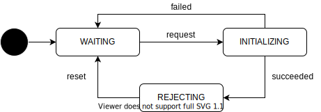

# Pose Initialization State

この状態は Autoware の自己位置初期化要求の受け付け可否を表しており、自己位置推定機能の起動が完了すると使用可能になります。
自己位置の初期化を受け付けている場合、手動で初期位置を与えるか、GNSS から初期位置を取得して初期化を開始することができます。
初期化の処理が終了すると、その成否に関わらず、再度初期化が可能となります。

| State        | Description                                            |
| ------------ | ------------------------------------------------------ |
| WAITING      | 自己位置の初期化のために、要求を受け付けている状態。   |
| INITIALIZING | 自己位置を初期化しており、要求を受け付けていない状態。 |
