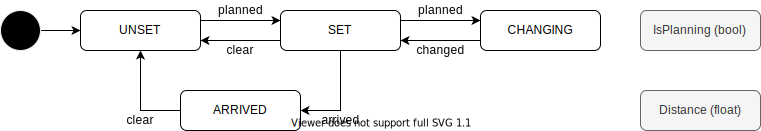

# Route

## Related API

- [/api/v1/route/state](../list/route-state.md)
- [/api/v1/route/clear](../list/route-clear.md)
- [/api/v1/route/set](../list/route-set.md)
- [/api/v1/route/data](../list/route-data.md)
- [/api/v1/route/lanelet/set](../list/route-lanelet-set.md)
- [/api/v1/route/lanelet/data](../list/route-lanelet-data.md)

## Route State

ルートに関する状態遷移。目的地へのルートが設定されているかを管理する。

| State    | Description                                        |
| -------- | -------------------------------------------------- |
| UNSET    | ルートが設定されていない状態。                     |
| SET      | ルートを設定されている状態。                       |
| CHANGING | ルートを走りながら別のルートを切り替えている状態。 |
| ARRIVE   | ルートの終点まで到着した状態。                     |
