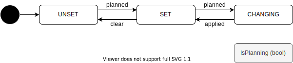

# Route State

## Route Main State

ルートに関する状態遷移。目的地へのルートが設定されているかを管理する。

| State    | Description                                        |
| -------- | -------------------------------------------------- |
| UNSET    | ルートが設定されていない状態。                     |
| SET      | ルートを設定されている状態。                       |
| CHANGING | ルートを走りながら別のルートを切り替えている状態。 |

## Route Goal State

目的地に関する状態遷移。ルートが設定されている場合に有効になる。 
※Route State (Set, Changing) のサブ状態にすることも検討する。

| State        | Description                    |
| ------------ | ------------------------------ |
| ON_THE_WAY   | ルートを走行している状態。     |
| ARRIVE_SOON  | ルートの終点に近づいた状態。   |
| ARRIVED_GOAL | ルートの終点まで到着した状態。 |
