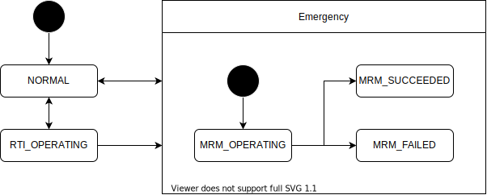

# Fail Safe API

## Description

The fail safe feature manages the behavior related to the abnormality of the vehicle.

## Fail Safe State

| State               | Description                                               |
| ------------------- | --------------------------------------------------------- |
| NORMAL              | The vehicle is normal.                                    |
| OVERRIDE_REQUESTING | The vehicle is normal, but the risk is high.              |
| MRM_OPERATING       | MRM is being executed because an error has been detected. |
| MRM_SUCCEEDED       | MRM succeeded. The vehicle is in a safe condition.        |
| MRM_FAILED          | MRM failed. The vehicle is still in an unsafe condition.  |

## Related API

- /api/fail_safe/state
