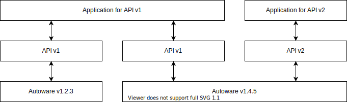

# Interface

## Related API

- /api/interface/version

## Version

The interface version corresponds to the specification and is independent of the Autoware version.
The same interface can be used even if the software implementation changes.

