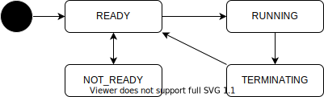

# Launcher API

- [/api/launcher/state](../list/api/launcher/state.md)
- [/api/launcher/request](../list/api/launcher/request.md)

## Description

This API manages the launch and termination of Autoware. Many APIs are only available after launching Autoware.
For details, see the page of each API. Unless otherwise stated, the API cannot be used when Autoware is not launched.

## States



| State       | Description                                                |
| ----------- | ---------------------------------------------------------- |
| NOT_READY   | Autoware cannot be launched.                               |
| READY       | Autoware can be launched.                                  |
| LAUNCHING   | Autoware is launching. The startup process is in progress. |
| RUNNING     | Autoware is running.                                       |
| TERMINATING | Autoware is terminating.                                   |

## Sequence

```plantuml

```
