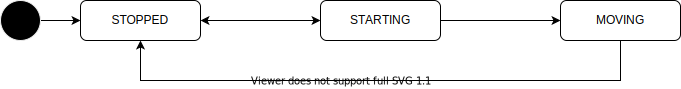

# Motion API

## Description

The motion feature manages the behavior that the vehicle plans.

## Motion State

| State    | Description                                             |
| -------- | ------------------------------------------------------- |
| STOPPED  | The vehicle is stopped.                                 |
| STARTING | The vehicle is about to start (so it is still stopped). |
| MOVING   | The vehicle is moving.                                  |

## Related API

- /api/motion/state
- /api/motion/factors
