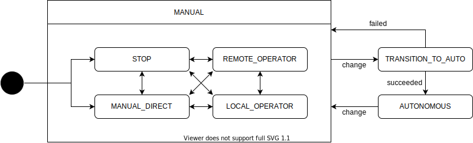

# Operation Mode

| State      | Description                                                               |
| ---------- | ------------------------------------------------------------------------- |
| DIRECT     | The vehicle is controlled directly. The behavior depends on the hardware. |
| NONE       | The vehicle is controlled to hold a stop.                                 |
| LOCAL      | The vehicle is controlled by the local operator.                          |
| REMOTE     | The vehicle is controlled by the remote operator.                         |
| AUTONOMOUS | The vehicle is autonomously controlled.                                   |
