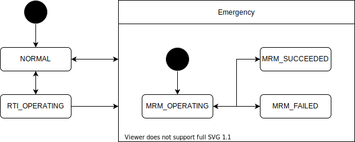

# Fail-safe API

- {{ link_ad_api('/api/fail_safe/state') }}

## Description

This API manages the behavior related to the abnormality of the vehicle.
Provides the state of Request to Intervene (RTI), Minimal Risk Maneuver (MRM) and Minimal Risk Condition (MRC).

## States

### MRM

| State         | Description                                               |
| ------------- | --------------------------------------------------------- |
| NORMAL        | The vehicle is normal.                                    |
| RTI_OPERATING | The vehicle is normal, but the risk is high.              |
| MRM_OPERATING | MRM is being executed because an error has been detected. |
| MRM_SUCCEEDED | MRM succeeded. The vehicle is in a safe condition.        |
| MRM_FAILED    | MRM failed. The vehicle is still in an unsafe condition.  |

### MRC

| State            | Description |
| ---------------- | ----------- |
| NONE             |             |
| COMFORTABLE_STOP |             |
| SUDDEN_STOP      |             |
