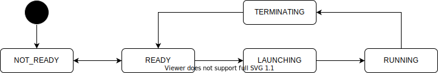

# Launch API

- {{ link_ad_api('/api/launch/state') }}

## Description

This API manages the launch and termination of Autoware. Most APIs are only available after launching Autoware.
For details, see the page of each API. Unless otherwise stated, the API cannot be used when Autoware is not launched.

## States

| State        | Description              |
| ------------ | ------------------------ |
| INITIALIZING | Autoware is launching.   |
| RUNNING      | Autoware is running.     |
| FINALIZING   | Autoware is terminating. |
