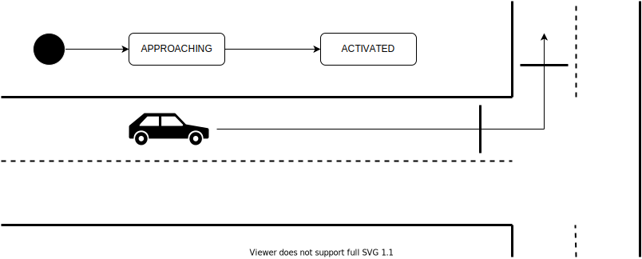

# Planning API

- {{ link_ad_api('/api/planning/state') }}
- {{ link_ad_api('/api/planning/start') }}
- {{ link_ad_api('/api/planning/factors') }}

## Description

This API manages the behavior that the vehicle plans.
Applications can announce to the people around and display the vehicle behavior to the operator.

## States

The planning state manages the stop and start of the vehicle.
Once

| State    | Description                                         |
| -------- | --------------------------------------------------- |
| STOPPED  | The vehicle is stopped.                             |
| STARTING | The vehicle is stopped, but is requesting to start. |
| MOVING   | The vehicle is moving.                              |

## Factors

The planning factors are information on the behavior that the vehicle plans.
There are two types of factors, stop and direction change.
For each type, the meanings of the data members are as follows.

| Type                        | Behavior         | Description |
| --------------------------- | ---------------- | ----------- |
| STOP_SIGN                   | planned stop     |             |
| USER_DEFINED_DETECTION_AREA | planned stop     |             |
| INTERSECTION                | planned stop     |             |
| CROSSWALK                   | planned stop     |             |
| FROM_PRIVATE_ROAD           | planned stop     |             |
| SIDEWALK                    | planned stop     |             |
| NO_STOPPING_AREA            | planned stop     |             |
| TRAFFIC_LIGHT               | planned stop     |             |
| INFRASTRUCTURE_COOPERATION  | planned stop     |             |
| REAR_CHECK                  | planned stop     |             |
| FRONT_OBSTACLE              | planned stop     |             |
| SURROUND_OBSTACLE           | immediate stop   |             |
| LANE_CHANGE                 | lane change      |             |
| AVOIDANCE1                  | lane change      |             |
| AVOIDANCE2                  | lane change      |             |
| DIRECTION_CHANGE            | direction change |             |
| PULL_OVER                   | direction change |             |
| PULL_OUT                    | direction change |             |
| EMERGENCY_STOP_OPERATION    | (dependent)      |             |

### Planned stop

### Immediate stop

### Direction change

### Lane change

