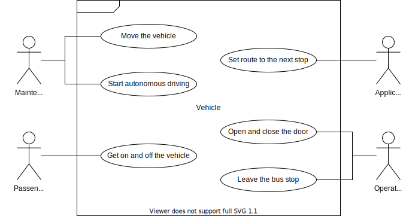

# Use Case of Bus Service

## Overview

This use case is a bus operation service that goes around the designated stops.

## Diagram

## Scenario

1. [Launch Autoware](launch-autoware)
1. The maintenance staff sets the schedule for the application.
1. The application sets the route to the first bus stop. ([/api/route/set](../list/route-set.md))
1. The operator changes the operation mode to manual. ([/api/operator/change](../list/operator-change))
1. The operator drives the vehicle to the entry position.
1. The operator changes the operation mode to autonomous. ([/api/operator/change](../list/operator-change))
1. The operator waits for the vehicle to be ready. ([/api/driving/state](../list/driving-state))
1. The operator starts the vehicle. ([/api/driving/engage](../list/driving-engage))
1. The application waits for the vehicle to arrive at bus stop. ([/api/route/state](../list/route-state))
1. The application sets the route to the next bus stop. ([/api/route/set](../list/route-set))
1. The operator controls the doors. ([/api/door/operate](../list/door-operate))
1. The operator waits for the vehicle to be ready. ([/api/driving/state](../list/driving-state))
1. The operator starts the vehicle. ([/api/driving/engage](../list/driving-engage))

## Considerations

Currently, Autoware can only handle the route to next bus stop. This is suitable for on-demand driving where next bus stop changes dynamically, but it is inefficient on routes that do not change. Therefore, consider multiple routes. Also, consider how to specify the stop by name instead of pose.
