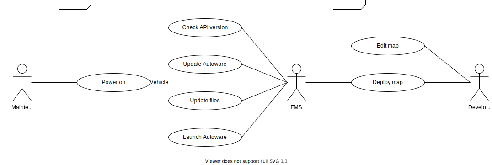

# Use Case of Launch Autoware

## Overview

Launching Autoware is a common process for most use cases.

## Diagram

## Scenario

1. Power on
   - The maintenance staff turns on the vehicle.
   - The operating system starts the service of AD API.
1. Check version
   - The application checks the API version using [/api/version](../list/api-version).
1. Update version
   - The application checks the Autoware version. (T.B.D.)
   - The application fetches the list of available Autoware versions. (T.B.D.)
   - The application updates the Autoware version. (T.B.D.)
   - The application waits for the Autoware version update to complete. (T.B.D.)
1. Update files
   - The application updates map. (T.B.D.)
   - The application updates parameter. (T.B.D.)
1. Launch Autoware
   - The application launches all modules of Autoware when the update is completed. (T.B.D.)
   - The operating system can launch directly if the update is not required.

## Considerations

Consider Over The Air (OTA).
