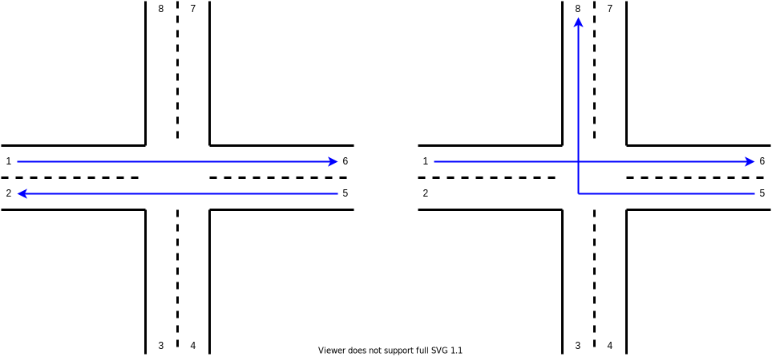
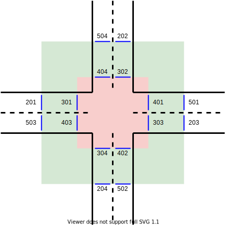

# V2I gate control

## 概要

V2I gate control は施設が設定する管理区域に対して通行権の取得と解放を行う。この仕組みで通常のゲートだけでなく交差点やエレベーターの調停を行うこともできる。
各施設には管理区域と通信区域が設定されており、車両は以下の手順にしたがって管理区域を通行する。
施設側で管理区域を監視しているなど、解放処理が必要なければ手順 4 の時点から通常通り走行を続けることができる。

1. 車両は管理区域に入らないよう、管理区域の始点 (B) で停止する計画で走行する。
1. 通信区域の始点 (A) に到達したら、施設に対して通行権の取得を要求する。
1. 通行権を取得できない場合、当初の計画通り管理区域の始点 (B) で停止する。
1. 通行権を取得したら、通信区域の終点 (D) で停止する計画で走行する。
1. 管理区域の終点 (C) を通過したら、施設に対して通行権の解放を要求する。
1. 通行権を解放できない場合、当初の計画通り通信区域の終点 (D) で停止する。
1. 通行権を解放したら、通信区域から抜けて通常通り走行を続ける。



## キャンセル

施設側が特定の車両に与えた通行権を取り消したい場合、施設から車両に向けて取り消し要求を出す。
車両側からの取り消しの承認応答が確認できた段階から、該当車両の通行権がないものとして扱うことができる。

## パラメーター

交差点やエレベーターには複数の出入り口があるため、通行権の取得時に進入地点と退出地点を含めて施設に送信する。
施設はこの情報を使用して通行権を付与するか判断できる。例えば交差点では直進同士は同時に通行権を与えられるが、右折が入ると進路が干渉してしまう。
また、施設を一意に識別するための施設 ID と、車両を一意に識別するための車両 ID も必要となる。



## 状態遷移



## API

- /v2i/api/gate/acquire
- /v2i/api/gate/release
- /v2i/api/gate/cancel

## メッセージ

```txt
# acquire/release

string subtype
string vehicle
string target
KeyValue args[]
KeyValue data[]
---
ResponseStatus status
```

```txt
# cancel

string target
---
ResponseStatus status
```

## アーキテクチャー

メッセージに含まれる `subtype` はサービス事業者が任意に設定できる文字列で、実装を切り替えるなどの目的で使用できる。
施設が複数ある場合は `target` を使って対象となる施設を指定する。
通行権の取得時に `vehicle` を使って車両の識別情報を送っているので、施設側はこの情報を使ってキャンセルしたい車両を指定する。



## Lanelet

図のような交差点を表現する場合、通信区域の始点と終点、管理区域の始点と終点にラインを引いて表す。
通信区域の終点と管理区域の始点は、停止する可能性があるので停止線に設定する。



対象施設全体

```xml
<relation id="101">
  <member type="way" role="acquire_start" ref="201"/>
  <member type="way" role="acquire_start" ref="202"/>
  <member type="way" role="acquire_start" ref="203"/>
  <member type="way" role="acquire_start" ref="204"/>
  <member type="way" role="acquire_check" ref="301"/>
  <member type="way" role="acquire_check" ref="302"/>
  <member type="way" role="acquire_check" ref="303"/>
  <member type="way" role="acquire_check" ref="304"/>
  <member type="way" role="release_start" ref="401"/>
  <member type="way" role="release_start" ref="402"/>
  <member type="way" role="release_start" ref="403"/>
  <member type="way" role="release_start" ref="404"/>
  <member type="way" role="release_check" ref="501"/>
  <member type="way" role="release_check" ref="502"/>
  <member type="way" role="release_check" ref="503"/>
  <member type="way" role="release_check" ref="504"/>
  <tag k="type" v="regulatory_element"/>
  <tag k="subtype" v="v2i_gate_control"/>
  <tag k="name" v="intersection_coordination"/>
  <tag k="data::foo" v="42"/>
</relation>
```

通信区域始点（通行権取得開始）、管理区域終点（通行権解放開始）

```xml
<way id="201">
  <nd ref="601"/>
  <nd ref="602"/>
  <tag k="type" v="line_thin"/>
  <tag k="subtype" v="solid"/>
</way>
```

管理区域始点（通行権取得確認）、通信区域終点（通行権解放確認）

```xml
<way id="301">
  <nd ref="611"/>
  <nd ref="612"/>
  <tag k="type" v="stop_line"/>
  <tag k="subtype" v="solid"/>
</way>
```
