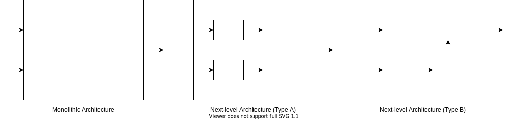

# Autoware Interface Design

## Abstract

Autoware defines two categories of interfaces. The first one is Autoware AD API for operating the vehicle from outside the autonomous driving system such as the Fleet Management System (FMS) and Human Machine Interface (HMI) for operators or passengers. The second one is Autoware Component Interface for internal components to communicate with each other.

## Concept

- Applications can operate multiple and various vehicles in a common way.

  

- Applications are not affected by version updates and implementation changes.

  

- Developers only need to know the interface to add new features and hardware.

  

## Requirements

Goals:

- AD API provides stable and long-term specifications. This enables unified access to all vehicles.
- AD API hides differences in version and implementation and absorbs the impact of changes.
- AD API has a default implementation and can be applied to some simple ODDs with options.
- The AD API implementation is extensible with the third-party components as long as it meets the specifications.
- Component Interface provides stable and medium-term specifications. This makes it easier to add components.
- Component Interface clarifies the public and private parts of a component and improves maintainability.
- Component Interface is extensible with the third-party design to improve the sub-components' reusability.

Non-goals:

- AD API does not cover security. Use it with other reliable methods.
- Component Interface is just a specification, it does not include an implementation.

## Architecture

The components of Autoware are connected via Component Interface.
Each component uses the interface to provide functionality and to access other components.
AD API implementation is also a component.
Since the functional elements required for AD API are defined as Component Interface, other components do not need to consider AD API directly.
Tools for evaluation and debugging, such as simulators, access both AD API and Component Interface.

Component Interface has a hierarchical specification.
The top-level architecture consists of some components. Each component has some options of the next-level architecture.
Developers select one of them when implementing the component. The simplest next-level architecture is monolithic.
This is an all-in-one and black box implementation, and is suitable for small group development, prototyping, and very complex functions.
Others are arbitrary architecture consists of sub-components and have advantages for large group development.
A sub-component can be combined with others that adopt the same architecture.
Third parties can define and publish their own architecture and interface for open source development.
It is desirable to propose them for standardization if they are sufficiently evaluated.

## Features

This section describes common features for all interfaces in Autoware. See the following for each interface.

- Features of AD API
- Features of Component Interface

### Communication Method

As shown in the table below, interfaces are classified into four communication methods to define their behavior.
Function Call is a request-response communication and is used for processing that requires immediate results. The others are publish-subscribe communication.
Notification is used to process data that changes with some event, typically a callback. Streams handle continuously changing data.
Reliable Stream expects all data to arrive without loss, Realtime Stream expects the latest data to arrive with low delay.

| Communication Method | ROS Implementation                | Optional Implementation |
| -------------------- | --------------------------------- | ----------------------- |
| Function Call        | Service                           | HTTP                    |
| Notification         | Topic (reliable, transient_local) | MQTT (QoS=2, retain)    |
| Reliable Stream      | Topic (reliable, volatile)        | MQTT (QoS=2)            |
| Realtime Stream      | Topic (best_effort, volatile)     | MQTT (QoS=0)            |

These methods are provided as services or topics of ROS since Autoware is developed using ROS and mainly communicates with its packages.
On the other hand, FMS and HMI are often implemented without ROS, Autoware is also expected to communicate with applications that do not use ROS.
It is wasteful for each of these applications to have an adapter for Autoware, and a more suitable means of communication is required.
HTTP and MQTT are suggested as additional options because these protocols are widely used and can substitute the behavior of services and topics.
In that case, text formats such as JSON, where field names are repeated in an array of objects, are inefficient and it is necessary to consider the serialization.

### Naming Convention

The name of the interface must be `/<component name>/api/<version>/<interface name>`,
where `<component name>` is the name of the component. For an AD API component, omit this part and start with `/api`.
The `<version>` is a major version with `v` such as `v1`. This can provide older interfaces for backward compatibility.
The `<interface name>` is an arbitrary string separated by slashes.
Note that this rule causes a restriction that the namespace `api` must not be used as a name other than AD API and Component Interface.

The following are examples of correct interface names for AD API and Component Interface:

- /api/v1/autoware/state
- /api/v1/autoware/engage
- /planning/api/v1/route/change
- /vehicle/api/v1/status

The following are examples of incorrect interface names for AD API and Component Interface:

- /api/autoware/state
- /autoware/state
- /planning/route/api/v1
- /vehicle/my_api/v1/status

### Logging

It is recommended to log the interface for analysis of vehicle behavior.
If logging is needed, rosbag is available for topics, and use logger in rclcpp or rclpy for services.
Typically, create a wrapper for services and clients that logs when a method is called.

### Constants and Enumeration

列挙型で使用する定数には、ゼロやから文字列など型のデフォルト値を使用しないでください。
これは値を設定を忘れた場合に意図しない動作を防ぎます。必要ならばデフォルト値として UNKNOWN を定義してください。

列挙型の値を直接使用しないでください。数値の割り当てはバージョンの更新時に変更される可能性があります。
数値の変更は後方互換性が維持されるものとして扱います。つまり、minor バージョンの変更に留まります。

### Restrictions

For each API, consider the restrictions such as following and describe them if necessary.

Services:

- response time
- pre-condition
- post-condition
- execution order
- concurrent execution

Topics:

- recommended delay range
- maximum delay
- recommended frequency range
- minimum frequency
- default frequency

## Data Structure

This section describes common data structure for all interfaces in Autoware. See the following for each interface.

- Data Structure of AD API
- Data Structure of Component Interface

### Request Header

T.B.D. (現段階では必須のデータなし)

### Response Status

Function Call uses the following response code to handle the return value in general.

| Group  | Code   | Description   |
| ------ | ------ | ------------- |
| 0x0000 | 0x0000 | UNKNOWN       |
| 0x1000 | -      | OK            |
| 0x1000 | 0x1001 | SUCCESS       |
| 0x1000 | 0x1002 | ACCEPTED      |
| 0x1000 | 0x1003 | NO_EFFECT     |
| T.B.D. | T.B.D. | UNAVAILABLE   |
| T.B.D. | T.B.D. | WARNING       |
| T.B.D. | T.B.D. | ERROR         |
| T.B.D. | T.B.D. | FORBIDDEN     |
| T.B.D. | T.B.D. | NOT_SUPPORTED |
| T.B.D. | T.B.D. | TIMEOUT       |

## Concern, Assumption, and Limitation

T.B.D.
