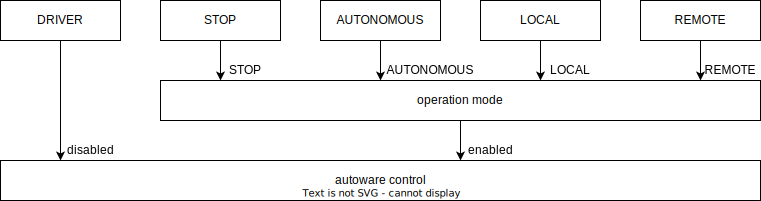

# Operation mode compatibility

## 構成（TIER IV API）

TIER IV API は、以下のような２つの入力セレクター（operator と observer）と、２つのフィルター（pause_driving と engage）からなる構成に基づいて設計されました。
フィルターの engage は車両の直接操作時（DRIVER）以外では常に適用され false の場合にコマンドを停止で上書きする効果を持ちます。
もう一方のフィルターの pause_driving は AUTONOMOUS のみが対象で true の場合に車両の最高速度を 0 km/h に設定することで車両を停止させていました。

## 構成（AD API）

AD API では、フィルターによる停止コマンドへの上書きは廃止され、代わりに STOP モードからの入力という形でセレクターに処理が統合されました。
全体では以下のような２つの入力セレクター（operation mode と autoware control）による構成に変更されています。
DRIVER のみが車両を直接制御している状態であるため、この部分のみを autoware control として分離し、残りが Autoware 制御下での operation mode の切り替えとなりました。
詳細は [Operation mode API](https://autowarefoundation.github.io/autoware-documentation/main/design/autoware-interfaces/ad-api/features/operation_mode/) を参照してください

## ステート対応表

以下に TIER IV API と AD API のステートの対応表を示します。車両の直接制御を切り替える場合のみ autoware control を操作し、それ以外の場合には operation mode を操作してください。

