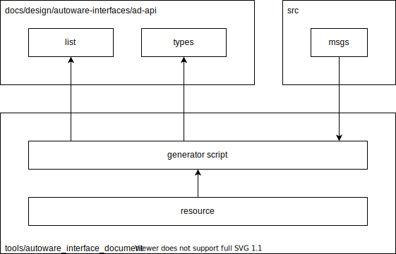

# autoware interface document generator

## Design



## Usage

Clone dependent packages.

```bash
mkdir src
vcs import src < adapi.repos
```

Build.

```bash
colcon build --symlink-install --packages-up-to autoware_interface_document
```

Execute.

```bash
source install/setup.bash
ros2 run autoware_interface_document generate
```

Format.

```bash
find docs/design/autoware-interfaces/ad-api | xargs pre-commit run --files
```
